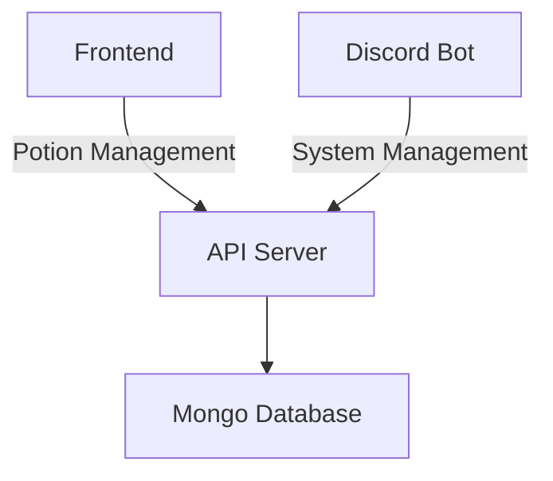

# Libra Alchemy app

* [Project Goals](#Project Goals)
* [Road Map](#Road Map)
* [Installation](#Installation)
    * [Development](#Development)
    * [Production](#Production)
* [Architecture](#Architecture)


### Project Goals

This project provides interface for libra masters to handle the in-game alchemy mechanics. It consists of:
* A way to create and remove potions.
* View potions and their affects.
* Download the list of potions to a CSV file.

### Road Map
* [ ] **Devops**
    * [ ] Automated deployment to GKE using github actions.
    * [ ] Control deployment of the system using Discord bot.
* [ ] Documentation
    * [ ] Document the usage of the system using mkdocs site.
* [ ] **Potion Management**
    * [ ] Download current potions in the push of a button.
    * [ ] Print potion using p-touch


### Installation

##### Development 

Install [docker](https://docs.docker.com/engine/install/) and on your system. After you have installed docker, simply 
run:

```bash
docker compose up
```

which will install the entire system locally. 

##### Production

Uploads the system automatically to GKE using Github actions. Please refear to the .github folder in order to view it.

### Architecture

